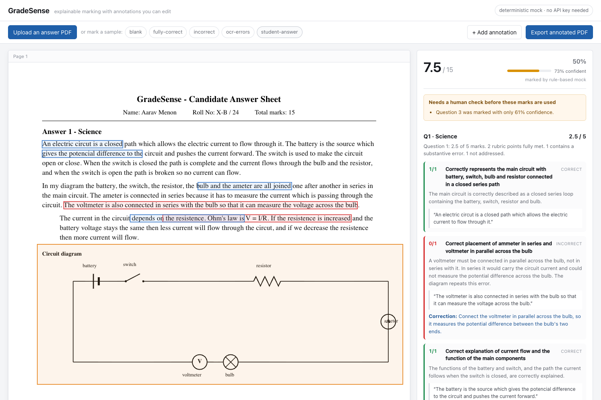

# GradeSense

A grading tool that reads a student answer, marks it against a rubric, explains every
mark with a quote from the student, and draws the mistakes on the answer paper — where
a teacher can drag, retype or delete them without re-grading anything.

Built for the GradeSense AI/ML Product Engineering assignment.



---

## Run it

**No API key required.** The default provider is a deterministic rule-based grader, so
the app and the entire test suite run out of the box.

```bash
npm install
npm run seed     # generates the five student answer PDFs into fixtures/answers/
npm run dev      # API on :4000, web app on :5173
```

Open **http://localhost:5173**, click **student-answer** in the toolbar, and you have a
marked paper in about two seconds.

```bash
npm test         # 106 tests, no API key needed
npm run typecheck
```

Requires Node 20.11 or newer (developed on Node 24).

### Using the real Claude API

```bash
cp .env.example .env
# set MODEL_PROVIDER=anthropic and ANTHROPIC_API_KEY=sk-ant-...
npm run dev
```

The header badge switches from "deterministic mock" to the live model name. `.env` is
gitignored; no key is committed. If `MODEL_PROVIDER=anthropic` is set without a key, the
server logs a warning and falls back to the mock rather than starting a server that
fails on first use.

The real path uses `claude-opus-5` with structured outputs, and sends the answer PDF as
a document block so the model can **see** the circuit diagram and the demand/supply
graph — the diagram criteria are otherwise ungradeable.

---

## What to look at first

| | |
|---|---|
| **The marking** | Click `student-answer`. It scores **7.5 / 15**. Every criterion shows its mark, the reasoning, the quote it rests on, and the correction. |
| **The annotations** | 16 boxes on the paper, colour-coded by type. Click one to open its editor. |
| **Editing without re-grading** | Drag a box, retype its correction, delete it, or click **+ Add annotation** and draw your own. The score never moves. |
| **Honesty** | Q3 is flagged for review at 61% confidence. Expand "Why the confidence is 61%" and "Automatic corrections applied" to see exactly why. |
| **Export** | **Export annotated PDF** produces a copy with numbered marks plus a full marking summary. The original file is never touched. |
| **The other papers** | `fully-correct` (15/15), `incorrect` (0/15), `blank` (0/15, no model call), `ocr-errors` (15/15 through a bad scan). |

Sample deliverables: [`docs/example-annotated-answer.pdf`](docs/example-annotated-answer.pdf),
[`docs/error-key.md`](docs/error-key.md), [`docs/test-output.txt`](docs/test-output.txt).

---

## How it works

Full detail in [`docs/architecture.md`](docs/architecture.md). The short version:

```
upload → ingest (text + per-run rectangles) → segment per question
       → blank check (skips the model entirely)
       → grade one question at a time
       → VALIDATE: clamp, recompute, verify evidence, score confidence
       → anchor quotes to rectangles
       → persist result + annotations separately
```

The organising idea is that **the model is an untrusted input**. It is good at
judgement and bad at arithmetic, and it will occasionally cite a quote that is not
there. So the rules the brief states as requirements are enforced in code, not asked
for in the prompt:

- **Marks never exceed the maximum.** Every criterion is clamped and the correction is
  written to an audit trail the UI displays.
- **The total is always recomputed** from the clamped criteria. The model is never asked
  for a total, so it cannot hallucinate one.
- **Feedback is checked against the answer.** Every quote is located in the student's
  text. One that cannot be found is marked unverified, loses its annotation, and drags
  confidence down.
- **The original is never modified.** Export composes a new document; a test hashes the
  stored file before and after to prove it.
- **Uncertainty is stated, not hidden.** Confidence is arithmetic over what was actually
  verified, and every review reason is a plain-language sentence.

### Reliability

| Case | Behaviour |
|---|---|
| Blank answer | Zero marks, `blank` state, review flagged — **without calling the model** |
| Marks above the maximum | Clamped, total recomputed, both logged, paper flagged |
| Malformed output | One repair retry; still bad → question marked `ungraded`, never guessed |
| Model / API failure | Backoff retries, then a structured **503**; nothing partial persisted |
| Fabricated evidence | Citation marked unverified, annotation dropped, confidence collapsed |
| Unclear / OCR-damaged answer | Content still credited; character damage annotated, not deducted |
| Non-PDF or corrupt upload | Rejected at the boundary with a typed error code |

---

## Project layout

```
packages/shared    Zod schemas and types shared by the API and the web app
packages/server    Express API, PDF ingest, grading pipeline, export
packages/web       React viewer, annotation overlay, rubric panel
scripts/           Authors the five student answer PDFs
fixtures/          rubric.json + the generated answer papers
docs/              Architecture, error key, test output, annotated example
```

### The student answers

Written by hand in [`scripts/answer-content.ts`](scripts/answer-content.ts) and rendered
by pdfkit, so the diagrams are real vector drawings and every flaw is deliberate. The
flagship paper plants a voltmeter wired in series, Ohm's law written as `V = I/R` beside
correct reasoning, an opposing viewpoint dropped after one line, shortage and surplus
reversed, a graph with swapped axes, spelling and grammar errors, and a diagram that
runs past the margin. [`docs/error-key.md`](docs/error-key.md) lists all of them with
their corrections and expected mark impact — and the test suite asserts that exact
breakdown, so the key cannot drift from the system.

### API

```
POST   /api/documents                                  upload + ingest a PDF
POST   /api/samples                                    load the authored sample set
POST   /api/grade                                      mark a paper
GET    /api/results                                    history
GET    /api/results/:id                                result + annotations
POST   /api/results/:id/annotations                    add            ─┐
PATCH  /api/results/:id/annotations/:annotationId      move / edit     ├ never re-grade
DELETE /api/results/:id/annotations/:annotationId      delete         ─┘
POST   /api/results/:id/export                         annotated PDF copy
GET    /api/health                                     which provider is live
```

---

## Tests

106 tests across 5 files, all deterministic and keyless. Output in
[`docs/test-output.txt`](docs/test-output.txt).

Every case the brief asks for is covered, each by injecting a provider that misbehaves
in exactly that way — so the code under test is the code that ships:

fully correct · partially correct · incorrect · blank · OCR-like spelling errors ·
malformed and incomplete output · model/API failure · score exceeding the maximum

Plus invariants that must hold for every paper under every provider: the total equals
the sum of the rubric points, no mark exceeds its maximum, every rubric criterion is
accounted for, every annotation resolves to a valid rectangle or is flagged, and the
original PDF is byte-identical after export.

```bash
npm test
npx vitest run packages/server/src/grading/pipeline.test.ts   # just the grading cases
```

---

## Known limits

- **Blank detection is text-only.** A question answered with *only* a diagram and no
  prose would be read as unanswered. It is never silently zeroed — a blank question
  always forces the review flag and says so — but a vision pre-check would be better.
- **Diagram regions are approximate.** A vision model's bounding boxes are rough, so
  these are marked `region`, penalised in confidence, and expected to be nudged. That
  is one drag, which is what makes editable annotations the right answer here.
- **Question segmentation depends on "Answer N" headings.** A sheet without them falls
  back to giving every question the whole document and records that the boundaries are
  approximate, which lowers confidence.
- **The rubric is a validated transcription** of the provided marking scheme rather than
  extracted from the PDF at run time. Reasoning in `packages/server/src/rubric-source.ts`.
- **The mock grader is a mock.** It proves the pipeline is correct; it cannot tell you
  the *marking* is good. That needs an evaluation run against the real model, which is
  the first item in the architecture doc's next steps.

## AI assistance

Built with Claude Code. I directed the design decisions and reviewed every file; the
reasoning behind the non-obvious ones is written up in `docs/architecture.md`, and the
two bugs worth knowing about — the fuzzy matcher accepting a one-word meaning inversion,
and the SVG resize handle painting a 1300px stroke — are documented there and pinned by
tests.
