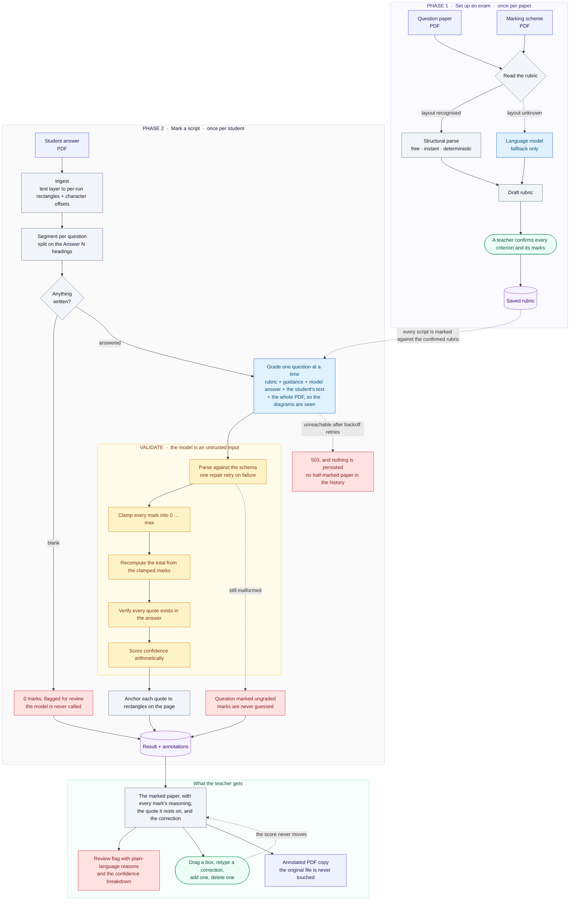
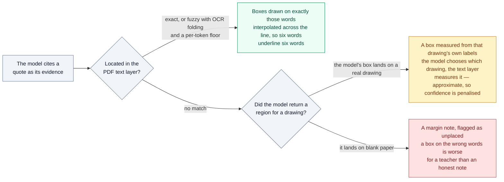

# GradeSense

A grading tool that reads a student answer, marks it against a rubric, explains every
mark with a quote from the student, and draws the mistakes on the answer paper — where
a teacher can drag, retype or delete them without re-grading anything.

Built for the GradeSense AI/ML Product Engineering assignment.


<p align="center"><em>The paper, its annotations, and the reason behind every mark — side by side.</em></p>

---

## Run it

**No API key required.** The default provider is a deterministic rule-based grader, so
the app and the entire test suite run out of the box. Add a Gemini or Claude key
when you want a real model — see [Using a real model](#using-a-real-model).

```bash
npm install
npm run seed     # generates the five student answer PDFs into fixtures/answers/
npm run dev      # API on :4000, web app on :5173
```

Open **http://localhost:5173**, click **student-answer** in the toolbar, and you have a
marked paper in about two seconds.

```bash
npm test         # 149 tests, no API key needed
npm run typecheck
```

Requires Node 20.11 or newer (developed on Node 24).

### Using a real model

Three providers are supported. All go through the same pipeline — same prompts,
same schemas, same clamping and evidence checks — so switching vendors changes
who answers, not what counts as a valid mark.

```bash
cp .env.example .env
```

**Groq** — the most generous free tier by a wide margin:

```bash
MODEL_PROVIDER=groq
GROQ_API_KEY=...          # https://console.groq.com/keys
```

**Gemini**

```bash
MODEL_PROVIDER=gemini
GEMINI_API_KEY=...        # https://aistudio.google.com/apikey
```

**Claude**

```bash
MODEL_PROVIDER=anthropic
ANTHROPIC_API_KEY=sk-ant-...
```

Then `npm run dev`. The header badge switches from "deterministic mock" to the
live model name. Defaults are `openai/gpt-oss-120b`, `gemini-2.5-flash` and
`claude-opus-5`; override with `GRADING_MODEL`.

#### Which one, and what you give up

A paper costs **one request per question**, so a three-question paper is three
requests. That makes the free tiers very unequal:

| Provider | Free requests/day | Papers/day | Sees the drawing? |
|---|---|---|---|
| Groq | 1,000 | ~333 | no — text only |
| Gemini | 20 | ~6 | yes |
| Claude | — (paid) | — | yes |

Gemini and Claude are sent the answer PDF itself, so they can **look at** the
circuit and the demand/supply graph. Groq's chat API takes text, so it is sent
the extracted text and the drawing's labels but not the drawing.

That difference is handled rather than hidden. The prompt tells a text-only
model, in those words, that it cannot see the diagram, that it must judge the
diagram criteria only from what the text establishes, and that it must never
describe a drawing it has not seen — then asks it to lower its own confidence,
which flows through to the human-review flag. The annotation boxes over the
drawings are unaffected either way: they are measured from the page, not
supplied by the model (see [architecture.md](docs/architecture.md)).

Check a key actually works before relying on it:

```bash
MODEL_PROVIDER=groq GROQ_API_KEY=... npm run check:provider
```

That marks one paper for real and prints the per-criterion breakdown, the
evidence-verification result and any corrections the pipeline had to apply.

`.env` is gitignored; no key is committed. If a provider is named without its
key the server says so and falls back to the mock, rather than starting up and
failing on the first request.

---

## What to look at first

| | |
|---|---|
| **The full flow** | **Set up an exam** → drop in the question paper, the marking scheme and a student answer. GradeSense reads the rubric out of the scheme, you confirm the marks, and it grades against *that*. |
| **The marking** | Or click `student-answer` to skip straight to a graded script. It scores **7.5 / 15**. Every criterion shows its mark, the reasoning, the quote it rests on, and the correction. |
| **The annotations** | 16 boxes on the paper, colour-coded by type. Click one to open its editor. |
| **Editing without re-grading** | Drag a box, retype its correction, delete it, or click **+ Add annotation** and draw your own. The score never moves. |
| **Honesty** | Q3 is flagged for review at 61% confidence. Expand "Why the confidence is 61%" and "Automatic corrections applied" to see exactly why. |
| **Export** | **Export annotated PDF** produces a copy with numbered marks plus a full marking summary. The original file is never touched. |
| **The other papers** | `fully-correct` (15/15), `incorrect` (0/15), `blank` (0/15, no model call), `ocr-errors` (15/15 through a bad scan). |

Sample deliverables: [`docs/example-annotated-answer.pdf`](docs/example-annotated-answer.pdf),
[`docs/error-key.md`](docs/error-key.md), [`docs/test-output.txt`](docs/test-output.txt).

---

## How it works

Full detail in [`docs/architecture.md`](docs/architecture.md). The short version:



The rubric is read from the uploaded marking scheme **structurally** where the
layout allows — no model call, no API key, same answer every time — and by the
language model only as a fallback. Either way it is a *draft* until a human
confirms it, because a mistake in a rubric is repeated across every script
marked with it. One review protects the whole batch.

The organising idea is that **the model is an untrusted input**. It is good at
judgement and bad at arithmetic, and it will occasionally cite a quote that is not
there. So the rules the brief states as requirements are enforced in code, not asked
for in the prompt:

- **Marks never exceed the maximum.** Every criterion is clamped and the correction is
  written to an audit trail the UI displays.
- **The total is always recomputed** from the clamped criteria. The model is never asked
  for a total, so it cannot hallucinate one.
- **Feedback is checked against the answer.** Every quote is located in the student's
  text. One that cannot be found is marked unverified, loses its annotation, and drags
  confidence down.
- **The original is never modified.** Export composes a new document; a test hashes the
  stored file before and after to prove it.
- **Uncertainty is stated, not hidden.** Confidence is arithmetic over what was actually
  verified, and every review reason is a plain-language sentence.

### From a quote to a box on the page

Every annotation has to land on the right words, and the only honest way to fail is to
say so. Three tiers, tried in order:



An unverified quote loses its annotation altogether and drags the paper's confidence
down, so a fabricated citation cannot quietly become a red box on a student's work.

### Reliability

| Case | Behaviour |
|---|---|
| Blank answer | Zero marks, `blank` state, review flagged — **without calling the model** |
| Marks above the maximum | Clamped, total recomputed, both logged, paper flagged |
| Malformed output | One repair retry; still bad → question marked `ungraded`, never guessed |
| Model / API failure | Backoff retries, then a structured **503**; nothing partial persisted |
| Fabricated evidence | Citation marked unverified, annotation dropped, confidence collapsed |
| Unclear / OCR-damaged answer | Content still credited; character damage annotated, not deducted |
| Non-PDF or corrupt upload | Rejected at the boundary with a typed error code |

---

## Project layout

```
packages/shared    Zod schemas and types shared by the API and the web app
packages/server    Express API, PDF ingest, grading pipeline, export
packages/web       React viewer, annotation overlay, rubric panel
scripts/           Authors the five student answer PDFs
fixtures/          rubric.json + the generated answer papers
docs/              Architecture, error key, test output, annotated example
```

### The student answers

Written by hand in [`scripts/answer-content.ts`](scripts/answer-content.ts) and rendered
by pdfkit, so the diagrams are real vector drawings and every flaw is deliberate. The
flagship paper plants a voltmeter wired in series, Ohm's law written as `V = I/R` beside
correct reasoning, an opposing viewpoint dropped after one line, shortage and surplus
reversed, a graph with swapped axes, spelling and grammar errors, and a diagram that
runs past the margin. [`docs/error-key.md`](docs/error-key.md) lists all of them with
their corrections and expected mark impact — and the test suite asserts that exact
breakdown, so the key cannot drift from the system.

### API

```
POST   /api/documents                                  upload + ingest a PDF
POST   /api/samples                                    load the authored sample set
POST   /api/rubrics/extract                            read a draft rubric from a scheme
POST   /api/rubrics                                    save a confirmed rubric
GET    /api/rubrics                                    list saved exams
POST   /api/grade                                      mark a paper (rubricId optional)
GET    /api/results                                    history
GET    /api/results/:id                                result + annotations
POST   /api/results/:id/annotations                    add            ─┐
PATCH  /api/results/:id/annotations/:annotationId      move / edit     ├ never re-grade
DELETE /api/results/:id/annotations/:annotationId      delete         ─┘
POST   /api/results/:id/export                         annotated PDF copy
GET    /api/health                                     which provider is live
```

---

## Tests

149 tests across 8 files, all deterministic and keyless. Output in
[`docs/test-output.txt`](docs/test-output.txt).

Every case the brief asks for is covered, each by injecting a provider that misbehaves
in exactly that way — so the code under test is the code that ships:

fully correct · partially correct · incorrect · blank · OCR-like spelling errors ·
malformed and incomplete output · model/API failure · score exceeding the maximum

Plus invariants that must hold for every paper under every provider: the total equals
the sum of the rubric points, no mark exceeds its maximum, every rubric criterion is
accounted for, every annotation resolves to a valid rectangle or is flagged, and the
original PDF is byte-identical after export.

```bash
npm test
npx vitest run packages/server/src/grading/pipeline.test.ts   # just the grading cases
```

---

## Known limits

- **Blank detection is text-only.** A question answered with *only* a diagram and no
  prose would be read as unanswered. It is never silently zeroed — a blank question
  always forces the review flag and says so — but a vision pre-check would be better.
- **Diagram regions are approximate.** A vision model's bounding boxes are rough, so
  these are marked `region`, penalised in confidence, and expected to be nudged. That
  is one drag, which is what makes editable annotations the right answer here.
- **Question segmentation depends on "Answer N" headings.** A sheet without them falls
  back to giving every question the whole document and records that the boundaries are
  approximate, which lowers confidence.
- **Structural rubric parsing is layout-dependent.** It reads the provided scheme
  exactly, and the language model is the fallback for a layout it does not
  recognise — but that fallback needs an API key. Without one, an unusual scheme
  is reported as unreadable rather than guessed at.
- **The mock grader is a mock.** It proves the pipeline is correct; it cannot tell you
  the *marking* is good. That needs an evaluation run against the real model, which is
  the first item in the architecture doc's next steps.

## AI assistance

Built with Claude Code. I directed the design decisions and reviewed every file; the
reasoning behind the non-obvious ones is written up in `docs/architecture.md`, and the
two bugs worth knowing about — the fuzzy matcher accepting a one-word meaning inversion,
and the SVG resize handle painting a 1300px stroke — are documented there and pinned by
tests.
